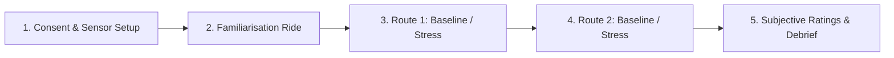

# VR Cycling Stress Response: Experiment Design & Architecture

**Chair**: Chair of Traffic Engineering and Control, Technical University of Munich (TUM)  
**Student**: Akhilesh Kadian  
**System**: Sumonity (SUMO + Unity Microscopic Traffic Simulation Interface)  

---

## 1. Study Overview & Structure

The experiment investigates cyclists' behavioural and physiological stress responses in virtual reality (VR) when exposed to controlled traffic conflict events in urban environments.



### Route & Scenario Breakdown

| Route | Event Zone | Scenario | Baseline Condition | Stress Condition |
| :--- | :--- | :--- | :--- | :--- |
| **Route 1** | **Point 5** | **Bus Stop Interaction** | Same route without bus conflict | Bus overtakes cyclist from the left near bus stop |
| **Route 1** | **Point 6** | **Right Turn Interaction** | Low / no surrounding traffic | Right turn with nearby mixed traffic |
| **Route 2** | **Construction Zone** | **Narrowing** | Construction geometry without vehicles | Narrowed lane + adjacent moving vehicles |
| **Route 2** | **Parking Zone** | *(Optional)* **Parked Car Pull-Out** | Static parked vehicles | Parked car unexpectedly pulls out |

---

## 2. Participant Protocol & Grouping

- **Target Sample Size**: $N = 18$ participants.
- **Participant Stratification**:
  - **Frequent Cyclists**: $\ge 3$ days/week riding experience.
  - **Infrequent Cyclists**: $< 3$ days/week riding experience.
- **Order Balancing**: Counterbalancing between Baseline and Stress runs across participants to prevent ordering bias.

---

## 3. Data Streams & Synchronization Pipeline

```mermaid
graph TD
    subgraph Synchronized Data Acquisition
        VR[Unity VR Simulator] -->|LSL / Markers / Trajectory| DataLogger[Central Data Pipeline]
        Physio[Physiological Sensors] -->|EDA / ECG / PPG / Temp| DataLogger
        Bike[Smart Bike / Trainer / IMU] -->|Speed / Cadence / Steering / IMU| DataLogger
    end
    
    subgraph Feature Extraction & Analysis
        DataLogger --> PreEvent[Pre-event Window (-10s)]
        DataLogger --> EventWin[Event Window (Start -> End)]
        DataLogger --> RecovWin[Recovery Window (+10s to +20s)]
        
        EventWin --> EDA_Analysis[EDA: Tonic SCL + Phasic SCR Peaks]
        EventWin --> ECG_Analysis[ECG: R-peaks, HR, HRV RMSSD/SDNN]
        EventWin --> Behave_Analysis[Behaviour: Speed Profile, Steering Jitter, Path Deviation]
        EventWin --> Subj_Analysis[Subjective: NASA-TLX / Stress Ratings]
    end
```

---

## 4. Scenario Documents

- [Scenario 1: Bus-Stop Interaction (Route 1, Point 5)](Scenario_1_Bus_Stop_Interaction.md)
- [Scenario 2: Right-Turn Mixed-Traffic Interaction (Route 1, Point 6)](Scenario_2_Right_Turn_Mixed_Traffic.md)
- [Mac Setup and Verification Guide](Mac_Setup_and_Verification_Guide.md)
