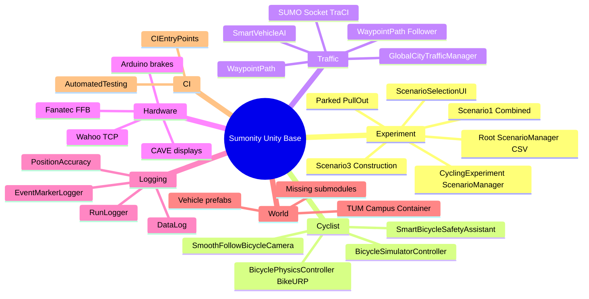
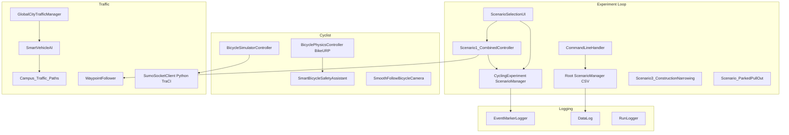

# Sumonity Unity Base Project — Mind Map

Unity **6000.4.2f1** VR cycling research simulator (TUM Chair of Traffic Engineering): SUMO microscopic traffic + TUM Main Campus 3D + bicycle (keyboard/VR or hardware trainer) for controlled stress-response experiments.

Primary scene: `Assets/Scenes/MainScene.unity`.

Related docs: [Experiment_Design_Overview.md](Experiment_Design_Overview.md), [PROJECT_HISTORY_AND_CHANGELOG.md](PROJECT_HISTORY_AND_CHANGELOG.md), [Scenario_1_Bus_Stop_Interaction.md](Scenario_1_Bus_Stop_Interaction.md), [Scenario_2_Right_Turn_Mixed_Traffic.md](Scenario_2_Right_Turn_Mixed_Traffic.md), [Mac_Setup_and_Verification_Guide.md](Mac_Setup_and_Verification_Guide.md).

---

## 1. System mind map

Three stacks must stay distinguished:

| Stack | Namespace / location | Role |
|---|---|---|
| **VR cycling experiment** | `CyclingExperiment.*` under `Assets/Scripts/` | In-Unity scenarios, campus waypoint traffic, waypoint AI, HUD, `EventMarkerLogger` |
| **SUMO / hardware study** | Root `Assets/ScenarioManager.cs`, `Assets/Sumonity/`, `BicycleSimulatorModel/` | CSV permutation, TraCI socket, Wahoo/Arduino/FFB |
| **Export leftover** | `Assets/ExportForNewProject/` | `RunLogger`, close-pass / hook-car events |

---

## 2. Routes and conditions

| Route | Event | Script | Baseline | Stress |
|---|---|---|---|---|
| **Route 1** Gabelsbergerstraße | Bus stop overtake then park | `Scenario1_CombinedController` | Same geometry, no bus conflict | Bus spawns behind, overtakes, parks in bay |
| **Route 1** Arcisstraße | Right-turn mixed traffic | same combined controller | Low / no surrounding traffic | Car overtakes and turns across cyclist |
| **Route 2** | Construction narrowing | `Scenario3_ConstructionNarrowing` | Barriers only | Adjacent vehicle through bottleneck |
| **Route 2** optional | Parked car pull-out | `Scenario_ParkedPullOut` | Static parked cars | Parked car pulls into bike lane |

`CyclingExperiment.Scenarios.ScenarioManager` tracks `ExperimentCondition` (`Baseline` vs `Stress`). Stress vehicles skip events when condition is Baseline.

Legacy standalone scripts still exist: `Scenario1_BusOvertake` (skips if combined controller is present), `Scenario2_RightTurn`.

---

## 3. Entry points / bootstrap

| Entry | File | What it does |
|---|---|---|
| CLI permutation | `Assets/Scripts/CommandLineHandler.cs` | Parses `--id` + `--Participantid`, calls **root** `ScenarioManager.SetPermutationId` |
| CSV experiment matrix | `Assets/ScenarioManager.cs` | Loads `Assets/random_seed.csv` (participant, route order, HMI H1–H6) |
| Active scenario/condition | `Assets/Scripts/Scenarios/ScenarioManager.cs` | Singleton: `StartScenario` / `EndScenario`, Baseline vs Stress |
| Early bike spawn | `Assets/BicycleSimulatorModel/Scripts/SimBikeSpawnController.cs` | `[DefaultExecutionOrder(-2000)]` teleports SimBike, freezes physics briefly |
| SUMO spawn sync | `Assets/Scripts/ScenarioSpawnApplier.cs` | After root scenario load: teleport, ground-snap, lock/unlock SUMO teleport |
| Export spawn | `Assets/ExportForNewProject/Scripts/ScenarioSpawnManager.cs` | Simpler teleport for export pipeline |
| Headless CI | `Assets/CICD/Editor/CIEntryPoints.cs` | Open scene, play, timed exit |
| Menu CI | `Assets/CICD/Scripts/CITesting/AutomatedTesting.cs` | `-executeMethod` helper |
| CAVE | `Assets/BicycleSimulatorModel/cavescreensetup/Scripts/CaveScreenStarter.cs` | Activates secondary displays |
| Frame rate | `Assets/FPS.cs` (`FrameRateController`) | VSync / target FPS on `Awake` |

Play-mode UI bootstrap: `ScenarioSelectionUI` opens a blocking modal on start (`M` / `Tab`); keys `1` Route 1, `2` Route 2, `3` free roam, `T` traffic, `V` camera.

---

## 4. Script inventory (project-authored)

RCCP / `Assets/CarModel/` is third-party and omitted here.

### `Assets/Scripts/` — VR cycling + shared utilities

**AI**

| File | Class | Purpose |
|---|---|---|
| `AI/WaypointPath.cs` | `WaypointPath` | Ordered waypoint list + gizmos; child order is travel order |
| `AI/WaypointFollower.cs` | `WaypointFollower` | Kinematic follow; `DestroyAtEnd`, pause/resume |
| `AI/RoadNetwork.cs` | `RoadNetwork` | Unused leftover graph (nodes/edges); not used for driving |
| `AI/RoadNode.cs` | `RoadNode` | Unused leftover junction vertex |
| `AI/RoadEdge.cs` | `RoadEdge` | Unused leftover directed polyline |
| `AI/Route2Corridor.cs` | `Route2Corridor` | Skybridge one-way geometry (no NavMesh) |
| `AI/SmartVehicleAI.cs` | `SmartVehicleAI` | Ambient cars on authored waypoint paths; gap + cyclist yield |
| `AI/PhysicsBusController.cs` | `PhysicsBusController` | Accel/brake bus along waypoints; unused by combined controller |
| `AI/BusAIController.cs` | `BusAIController` | Dwell at stop + overtake boost |
| `AI/ScenarioBusAudio.cs` | `ScenarioBusAudio` | Route 1 Bogdan 3D engine / brake / idle |
| `AI/TrafficIdentity.cs` | `TrafficIdentity` | Shared cyclist / vehicle checks for yield |
| `AI/GlobalCityTrafficManager.cs` | `GlobalCityTrafficManager` | Ambient prefab traffic on `Campus_Traffic_Paths`; `T` toggle |
| `AI/TrafficSpawner.cs` | `TrafficSpawner` | Generic multi-path spawner |
| `AI/IntersectionTrafficFlowManager.cs` | `IntersectionTrafficFlowManager` | Extra waypoint cars near the Route 1 right-turn junction |
| `AI/TrafficDestinationSet.cs` | `TrafficDestinationSet` | Dest_* snap targets leftover from the graph builder |
| `AI/SmartBicycleSafetyAssistant.cs` | `SmartBicycleSafetyAssistant` | Auto-brake + lateral nudge |
| `AI/VehicleRuntimeFactory.cs` | `VehicleRuntimeFactory` | Spawn helper: waypoint follower (scenarios) or SmartVehicleAI (ambient). Also contains unused leftover `GraphVehicleAI`. |

**Scenarios / UI / camera**

| File | Class | Purpose |
|---|---|---|
| `Scenarios/ScenarioManager.cs` | `ScenarioManager` | Active scenario + Baseline/Stress singleton |
| `Scenarios/EventMarkerLogger.cs` | `EventMarkerLogger` | CSV at `persistentDataPath/experiment_log_*.csv` |
| `Scenarios/Scenario1_CombinedController.cs` | `Scenario1_CombinedController` | Route 1 FSM: bus then right-turn |
| `Scenarios/Scenario1_BusOvertake.cs` | `Scenario1_BusOvertake` | Legacy bus-only |
| `Scenarios/Scenario2_RightTurn.cs` | `Scenario2_RightTurn` | Legacy intersection |
| `Scenarios/Scenario3_ConstructionNarrowing.cs` | `Scenario3_ConstructionNarrowing` | Route 2 narrowing |
| `Scenarios/Scenario_ParkedPullOut.cs` | `Scenario_ParkedPullOut` | Optional pull-out |
| `Scenarios/ScenarioTrigger.cs` | `ScenarioTrigger` | Player enter/exit UnityEvents + log |
| `UI/ScenarioSelectionUI.cs` | `ScenarioSelectionUI` | Runtime modal; teleport bike; traffic toggle |
| `UI/HUDController.cs` | `HUDController` | Speed / scenario / toast |
| `Camera/SmoothFollowBicycleCamera.cs` | `SmoothFollowBicycleCamera` | 3rd/1st person (`V`) |
| `Camera/FirstPersonCyclistCamera.cs` | `FirstPersonCyclistCamera` | Mouse-look first person |

**Other `Assets/Scripts/`**

| File | Class | Purpose |
|---|---|---|
| `CommandLineHandler.cs` | `CommandLineHandler` | CLI → root permutation |
| `DataLog.cs` | `DataLog` | High-freq SimBike / HMI CSV (Windows path) |
| `ScenarioSpawnApplier.cs` | `ScenarioSpawnApplier` | Bike teleport + SUMO lock |
| `ExperimentManager.cs` | `ExperimentManager` | LOD state machine; console markers only |
| `ExperimentTrigger.cs` | `ExperimentTrigger` | Volumes → `ExperimentManager` |
| `ArrowCueTrigger.cs` | `ArrowCueTrigger` | Show/hide arrow UI |
| `TrackLine.cs` | `TrackLine` | Progress + lateral error |
| `TrackLineRoadLine.cs` | `TrackLineRoadLine` | Centerline `LineRenderer` |
| `ReferencePathTracker.cs` | `ReferencePathTracker` | Live deviation from `P_*` children |
| `ReferencePathVisualizer.cs` | `ReferencePathVisualizer` | Draw reference path |
| `LowLodApplier.cs` | `RestoreLowFromHigh` | Copy materials City_HIGH → City_LOW |
| `CITesting/performanceMonitoring.cs` | `performanceMonitoring` | SUMO vs Unity position CSV |
| `Editor/ScenarioSetupMenu.cs` | `ScenarioSetupMenu` | One-click scene wiring |
| `Editor/WaypointPathEditor.cs` | `WaypointPathEditor` | Inspector + Scene Shift-click to author `WaypointPath` |
| `Editor/CampusTrafficPathMenu.cs` | `CampusTrafficPathMenu` | **Cycling Experiment → Create Campus Traffic Path** / **Create Path From Selection** |
| `Editor/RoadNetworkBuilder.cs` | `RoadNetworkBuilder` | Obsolete **Build Campus Road Graph** (unused for cars) |

### Root `Assets/*.cs`

| File | Class | Purpose |
|---|---|---|
| `ScenarioManager.cs` | `ScenarioManager` | CSV permutation / HMI matrix (**not** the cycling singleton) |
| `BikeSensor.cs` | `BikeSensor` | Ego trigger at bus stations |
| `DataLog.cs` | — | see Scripts |
| `DebugLogsManager.cs` | `DebugLogsManager` | Debug log toggle |
| `EventTriggerManager.cs` | `EventTriggerManager` | Activate GameObject batches A/B |
| `FPS.cs` | `FrameRateController` | FPS overlay + cap |
| `TextureMirror.cs` | `TextureMirror` | Flip `_MainTex_ST` |
| `TrafficLightController.cs` | `TrafficLightController` | Emissive blink |
| `TriggerZone.cs` | `TriggerZone` | First/Second zone → `EventTriggerManager` |

### Bicycle simulator / hardware (`Assets/BicycleSimulatorModel/`)

| File | Class | Purpose |
|---|---|---|
| `Scripts/BicycleSimulatorController.cs` | `BicycleSimulatorController` | Full physics bike; SUMO co-sim; Wahoo PI; Arduino serial |
| `bikesimconnector/Scripts/TCP_Client.cs` | `tcp_client` | Wahoo Kickr TCP (`192.168.0.2:36866`) |
| `Scripts/FFB_Bike.cs` | `FFBInspectorBike` | Fanatec FFB scaffold; `Update()` empty |
| `Scripts/SimulatorSteeringInput.cs` | `SimulatorSteeringInput` | Input System steering |
| `Scripts/SimBikeSpawnController.cs` | `SimBikeSpawnController` | Early-order spawn |
| `Scripts/BicycleSimulatorDataLogger.cs` | `BikeSimulatorDataLogger` | Wahoo CSV (hardcoded Windows path) |
| `Scripts/BikeSimulatorRealtimePlotter.cs` | `BikeSimulatorRealtimePlotter` | LineRenderer plots |
| `Scripts/CyclistAnimController.cs` | `CyclistAnimController` | Animator + IK weights |
| `Scripts/ProceduralIKHandler.cs` | `ProceduralIKHandler` | Procedural hip/chest/head/feet |
| `Scripts/BicycleSimulatorStatus.cs` | `BicycleSimulatorStatus` | Ragdoll / on-off bike |
| `Scripts/RagdollJointImitationSimulator.cs` | `RagdollJointImitationSimulator` | Ragdoll follows skeleton |
| `Scripts/RagdollJointConfigSimulator.cs` | `RagdollJointConfigSimulator` | Per-joint ConfigurableJoint |
| `Scripts/BicycleSimulatorCamera.cs` | `BicycleSimulatorCamera` | Chase cam |
| `Scripts/PerfectMouseLookSimulator.cs` | `PerfectMouseLookSimulator` | Smoothed look |
| `Scripts/TPSCamSwitchSimulator.cs` | `TPSCamSwitchSimulator` | Cam target switch |
| `Scripts/SuspensionManagerSimulator.cs` | `SuspensionManagerSimulator` | Suspension joints |
| `Scripts/BicycleSimulatorSounds.cs` | `BicycleSimulatorSounds` | Pedal / freewheel / impact |
| `Scripts/MobileButtonHandlerSimulator.cs` | `MobileButtonHandlerSimulator` | UI pointer buttons |
| `cavescreensetup/Scripts/CaveScreenStarter.cs` | `CaveScreenStarter` | Multi-display |
| `cavescreensetup/Scripts/projectionmatrixtest.cs` | `ExampleClass` | Off-center CAVE projections |
| `Editor/CyclistSetup.cs` | menu utils | Rig / IK setup |

In-Unity bicycle (no hardware): `Assets/BicycleModel/` and `Assets/Sumonity-BicycleModel/` (`BicyclePhysicsController`, `BicycleInput`, `BicycleLeanAnimator`, `BicycleSumoController`).

### SUMO bridge (`Assets/Sumonity/`)

| File | Purpose |
|---|---|
| `Scripts/SumoStarter.cs` | Starts SUMO connection |
| `Scripts/SumoSocketClient.cs` | Unity ↔ Python socket |
| `Scripts/helpers/SocketConnector.cs` | TCP helper |
| `Scripts/helpers/SumoSocketClientHelper.cs` | Client helpers |
| `Scripts/Models/SumoDataStructures.cs` | Shared data types |
| `Scripts/BikeLogger.cs` | Bike-side SUMO log |
| `SumoTraCI/socketServer.py` | Python TraCI ↔ Unity bridge |

### Export pipeline (`Assets/ExportForNewProject/Scripts/`)

`RunLogger`, `StartTrigger`, `FinishTrigger`, `LODMarkerTrigger`, `SimpleEventTrigger`, `ClosePassSpawner`, `ClosePassCarController`, `ScenarioSpawnManager`, `Event 2/SimpleHookTrigger`, `HookCarSpawner`, `HookCarController`.

### CI (`Assets/CICD/`)

`Editor/CIEntryPoints.cs`, `Scripts/CITesting/AutomatedTesting.cs`, `PositionAccuracyLogger.cs`, `PositionAccuracyUI.cs`, `PositionAccuracyExample.cs`, `ForceLoggerInit.cs`.

### Vehicle / world submodules (populated)

`BusModel`, `TaxiModel`, `PedestrianModel`, `Sumonity-PassengerCars`, `parkedvehiclespawner`, `3d_model` / `3d_model_v3`.

---

## 5. Known landmines

- **Two `ScenarioManager` classes.** Root `Assets/ScenarioManager.cs` = CSV permutation. `CyclingExperiment.Scenarios.ScenarioManager` = active scenario/condition. `CommandLineHandler` and `DataLog` use root; VR scenarios use the namespaced singleton. Wire the wrong one and nothing happens.
- **Missing submodules** (empty folders): `Assets/SumoProject`, `Assets/Sim-BusStop`, `Assets/Sumonity-Navigation`, `Assets/Sumonity-MapInterpreter`. Import via `vcs import < assets.repos`.
- **Missing build scene.** `EditorBuildSettings` enables `Assets/Scenes/MainScene_GroupB.unity`, which is not on disk. Present scene is `MainScene.unity`.
- **Standalone path break.** Root `ScenarioManager` reads `Path.Combine("Assets/", "random_seed.csv")` — editor-only.
- **Hardcoded Windows log paths** in `DataLog`, `BikeSimulatorDataLogger`, and `BicycleSimulatorController` debug CSV.
- **Filename ≠ class:** `FPS.cs` → `FrameRateController`; `LowLodApplier.cs` → `RestoreLowFromHigh`; `projectionmatrixtest.cs` → `ExampleClass`.
- **Incomplete / stubs:** `FFBInspectorBike.Update()` empty; `ExperimentManager.MarkEvent` console-only; `DataLog.Start` never subscribes `BikeSensor`; `PositionAccuracyExample.AnalyzeSpecificVehicle` placeholder; `AutomatedTesting` enters play mode with no assertions.
- **`CommandLineHandler`** aborts if `--Participantid` is missing even when `--id` is valid.
- **Performance:** `DataLog.CheckForNewObjects` / `performanceMonitoring` can `FindObjectsOfType<GameObject>()` every tick.
- **`tcp_client`** mutates state on the socket thread; handshake states 1–12 are fragile.
- **`SmartBicycleSafetyAssistant`** depends on `BikeURP.BicyclePhysicsController` — hardware SimBike stack is a different controller.
- Do not edit RCCP / `Assets/CarModel/` unless explicitly asked.

---

## 6. Controls (VR cycling play mode)

| Action | Key |
|---|---|
| Pedal / brake / steer | `W` `S` `A` `D` |
| Handbrake | `Space` |
| 1st / 3rd person | `V` |
| Ambient traffic | `T` |
| Scenario menu | `M` or `Tab` |
| Route 1 / 2 / free roam | `1` `2` `3` |
