# Scenario 1: Bus-Stop Interaction (Gabelsbergerstraße)

**Project**: VR Cycling Stress Response using Biometrics and Behavioural Data  
**Chair**: Chair of Traffic Engineering and Control, Technical University of Munich (TUM)  
**Route**: Route 1 (Gabelsbergerstraße)  
**Event Zone**: Point 5  

---

## 1. Scenario Overview

The **Bus-Stop Interaction** is the primary dynamic event on Route 1. The scenario investigates how cyclists respond behaviourally, physiologically, and subjectively when encountering a large overtaking public transit vehicle (bus) in proximity to a designated bus stop on Gabelsbergerstraße.

```
[Start of Route 1] ───► [Approaching Point 5 (70-80m)] ───► [Bus Overtake & Passing] ───► [Recovery Section] ───► [Point 6: Right Turn]
```

---

## 2. Experimental Conditions

| Parameter | Baseline Condition | Stress Condition |
| :--- | :--- | :--- |
| **Traffic Dynamics** | Free-flow cycling along Gabelsbergerstraße | Bus approaches from behind and overtakes cyclist |
| **Bus Presence** | No bus present in the immediate corridor / bus stop empty | Bus overtakes cyclist from the left and interacts near bus stop |
| **Cyclist Action** | Steady-state cycling at preferred cruising speed | Cyclist must react: modulate speed, brake, adjust lateral path, maintain safe gap |
| **Conflict Type** | None (Control baseline) | Proximity overtaking conflict with large vehicle |

---

## 3. Event Markers and Timeline Segmentation

For time-synchronized biometric and behavioural analysis, the scenario is divided into standardized window markers:

```mermaid
gantt
    title Scenario 1 Analysis Windows & Event Markers
    dateFormat X
    axisFormat %s s
    section Timeline
    Pre-event Window (-10s to 0s)      :done,    m1, 0, 10
    Bus Event Start (70-80m prior)    :crit, active, m2, 10, 11
    Interaction Window (Overtaking)   :active,  m3, 10, 25
    Bus Event End (Cyclist passes bus):crit, active, m4, 25, 26
    Recovery Window (+10s to +20s)    :done,    m5, 26, 46
```



### Marker Definitions

1. **Marker 1 — Bus Event Start (`BUS_START`)**:
   - **Trigger**: Cyclist reaches 70–80 m before the bus stop location on Gabelsbergerstraße.
   - **SUMO / Unity Action**: Bus spawns / accelerates from the rear lane to initiate overtaking.
2. **Marker 2 — Bus Event End (`BUS_EVENT_END`)**:
   - **Trigger**: After the bus has pulled into the bay and stopped, the cyclist successfully clears and passes its geometry.
   - **Unity Action**: The bus remains parked at the bus stop; the Route 1 recovery window begins.
3. **Marker 3 — Recovery Window (`RECOVERY_START` to `RECOVERY_END`)**:
   - **Duration**: 10–20 seconds of uninterrupted riding following the bus encounter.
   - **Purpose**: Allows electrodermal activity (EDA) and heart rate (HR) to return toward baseline before the next event zone.

---

## 4. Expected Responses & Measurement Plan

### A. Behavioural Metrics
- **Speed Profile**: Deceleration upon detecting the overtaking bus; speed variance during the passing manoeuvre.
- **Steering Variability**: Increased micro-corrections and lateral steering jitter due to proximity stress.
- **Path Deviation & Lateral Position**: Shift towards the right curb or away from the overtaking bus trajectory.
- **Braking / Deceleration**: Time-to-first-brake and maximum deceleration rate ($m/s^2$).
- **Event Completion Time**: Total duration from Marker 1 to Marker 2.

### B. Physiological Metrics
- **Electrodermal Activity (EDA)**:
  - Tonic skin conductance level (SCL) baseline drift.
  - Phasic skin conductance response (SCR) amplitude and peak frequency (expected peak latency: 1–5 seconds post-overtake onset).
- **Electrocardiography (ECG) / Heart Rate (HR)**:
  - Instantaneous heart rate ($HR$) elevation during overtaking.
  - Heart Rate Variability (HRV): RMSSD (Root Mean Square of Successive Differences) and SDNN (Standard Deviation of NN intervals) to quantify autonomic nervous system arousal.
- **Motion Artefact Control**:
  - IMU accelerometer streams on VR headset and handlebars used to clean motion artefacts from EDA/ECG.

### C. Subjective Metrics (Post-Route Questionnaire)
- **Perceived Stress Level** (1–7 Likert Scale / NASA-TLX subscale).
- **Perceived Safety & Comfort**.
- **Realism of Bus Behaviour**.
- **Perceived Difficulty / Workload**.

---

## 5. Current Unity Implementation

- **Scenario owner**: `Scenario1_CombinedController` is the single authority for Route 1. The older `Scenario1_BusOvertake` remains only as a standalone fallback and does not spawn a second bus when the combined controller exists.
- **Navigation**: The scenario bus follows the authored `Bus_Overtake_Path` waypoints, smoothly slows for its final bus-bay waypoint, then remains parked. This is deliberately deterministic for repeatable physiology windows; it is not driven by NavMesh or live SUMO during this scenario.
- **Traffic policy**: Scenario and ambient vehicles avoid other vehicles, while the designated stress vehicles intentionally do not yield to the cyclist. The cyclist-side safety assistant prevents clipping into a stopped vehicle.
