# Scenario 2: Right-Turn Mixed-Traffic Interaction

**Project**: VR Cycling Stress Response using Biometrics and Behavioural Data  
**Chair**: Chair of Traffic Engineering and Control, Technical University of Munich (TUM)  
**Route**: Route 1 (Gabelsbergerstraße ➔ Arcisstraße)  
**Event Zone**: Point 6  

---

## 1. Scenario Overview

The **Right-Turn Mixed-Traffic Interaction** represents the second critical dynamic event on Route 1, positioned immediately after the recovery section following the bus stop. The cyclist transitions from a protected/separated path into a complex intersection turning manoeuvre while interacting with adjacent motorized vehicular traffic.

```
[Point 5: Bus Stop] ──► [Recovery Section (10-20s)] ──► [Point 6: Right Turn Approach] ──► [Turning in Mixed Traffic] ──► [Stabilization / Route End]
```

---

## 2. Experimental Conditions

| Parameter | Baseline Condition | Stress Condition |
| :--- | :--- | :--- |
| **Traffic Density** | Low to zero surrounding vehicular traffic at the intersection | Moderate/dense mixed vehicle traffic surrounding the cyclist |
| **Intersection Proximity** | Cyclist completes right turn in an empty, clear lane | Vehicles turn alongside or yield in close proximity |
| **Cognitive & Visual Load** | Low decision-making requirement | High visual scanning, gap acceptance, and speed modulation demand |
| **Conflict Type** | Free-flow navigation (Control baseline) | Close-proximity non-collision mixed traffic interaction |

---

## 3. Event Markers and Timeline Segmentation

```mermaid
gantt
    title Scenario 2 Analysis Windows & Event Markers
    dateFormat X
    axisFormat %s s
    section Timeline
    Pre-event Window (-10s to 0s)      :done,    m1, 0, 10
    Right Turn Start (Approaching)     :crit, active, m2, 10, 11
    Interaction Window (Turning Phase) :active,  m3, 10, 25
    Right Turn End (Stabilized)        :crit, active, m4, 25, 26
    Post-event Window (+10s)           :done,    m5, 26, 36
```



### Marker Definitions

1. **Marker 1 — Right Turn Start (`RIGHT_TURN_START`)**:
   - **Trigger**: Cyclist arrives at the designated approach zone (e.g., 20–30 m before the intersection curb line at Point 6).
   - **SUMO / Unity Action**: Traffic flows into the intersection lanes, creating a realistic mixed-traffic queue or adjacent turning vehicles.
2. **Marker 2 — Interaction Window (`INTERACTION_WINDOW`)**:
   - **Duration**: Active negotiation of the right turn curve alongside motorized vehicles.
   - **SUMO / Unity Action**: Vehicles maintain safety clearances but remain in close visual and spatial proximity to the cyclist.
3. **Marker 3 — Right Turn End (`RIGHT_TURN_END`)**:
   - **Trigger**: Cyclist completes the turn arc, aligns heading with the new street axis (Arcisstraße), and resumes straight riding.
   - **SUMO / Unity Action**: Vehicles clear the intersection; data marker recorded for baseline stabilization.

---

## 4. Expected Responses & Measurement Plan

### A. Behavioural Metrics
- **Speed Profile**: Deceleration prior to intersection entry, hesitation / pacing during turn execution.
- **Steering Variability & Trajectory Arc**: Curvature deviation, tight cornering vs. wide arc due to vehicle proximity.
- **Head & Eye Tracking (VR)**: Visual gaze fixation on adjacent cars, glance frequency towards mirrors/blind spots.
- **Lateral Separation**: Distance maintained between the cyclist and motorized vehicles ($m$).
- **Braking Events**: Number and intensity of discrete braking inputs.

### B. Physiological Metrics
- **Electrodermal Activity (EDA)**:
  - Phasic skin conductance responses (SCR) triggered by sudden vehicle proximity or gap acceptance decisions.
  - Cumulative sympathetic arousal across the cumulative Route 1 sequence (Point 5 + Point 6).
- **Electrocardiography (ECG) & Heart Rate Variability (HRV)**:
  - Acute transient increase in Heart Rate ($HR$).
  - Sympathovagal balance shifts reflected in RMSSD and low-frequency/high-frequency (LF/HF) power ratios.

### C. Subjective Metrics (Post-Route Questionnaire)
- **Perceived Workload & Stress** (NASA-TLX / Subjective Stress Index).
- **Intersection Safety Perception**.
- **Confidence in Maneuvering Mixed Traffic**.
- **Realism of Surrounding Traffic Physics**.

---

## 5. Unity & SUMO Implementation Details

- **SUMO Network Junction**: Point 6 intersection defined in `tum_campus_escooter_study.net.xml`.
- **Vehicle Spawning**: Controlled via flows `f_0`, `f_1`, `f_2`, `f_3`, `f_4`, `f_5` in `test_demand_opensource_carOnly.rou.xml`.
- **Pure Pursuit & Collision Avoidance**: Managed by `SumoSocketClient.cs` and `socketServer.py` TraCI bridge.
